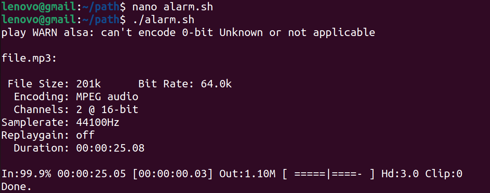

# Bash-Alarm-Clock
It is an alarm clock created using Bash Scripting.

Here are the step-by-step instructions to create a bash script for an alarm clock playing music:

1.  Open a text editor on your Linux system. You can use any text editor such as nano, vim, gedit, or emacs.
```bash
vi alarm.sh
```
2. Begin the script with the shebang line. The shebang line is the first line of the script, which tells the system what interpreter to use to run the script. In this case, we'll use `#!/bin/bash`.

3. Set the alarm time. You can set the alarm time by creating a variable in the script. For example, alarm_time="08:00" sets the alarm for 8:00 AM.

4. Get the current time. You can get the current time using the date command and format it to match the alarm time format.

```bash
# Get the current time
current_time=$(date +"%H:%M")
```

5. Enter a loop to check if the alarm time has been reached. You can use a while loop to continuously check the current time against the alarm time. The loop sleeps for one minute between checks to reduce the system load.
```bash
# Enter a loop to check if the alarm time has been reached
while [ "$current_time" != "$alarm_time" ]; do
    sleep 60 # wait for 1 minute
    current_time=$(date +"%H:%M") # update the current time
done
```
6. Play the music file when the alarm goes off. You can use the play command from the `sox` package to play the music file.

```bash
# Play the music file when the alarm goes off
play file.mp3
```

7. Our complete `alarm.sh` file:

```bash
#!/bin/bash

alarm_time="08:00"

current_time=$(date +"%H:%M")

while [ "$current_time" != "$alarm_time" ]; do
    sleep 60 # wait for 1 minute
    current_time=$(date +"%H:%M") # update the current time
done

play /path/to/music/file.mp3
```

8. Make the script executable using the `chmod` command.

```bash
chmod +x alarm.sh
```

9. Run the script using `./alarm.sh`.

10. If you get the errror: 

```bash
./alarm.sh: line 16: play: command not found
```
then the error message you are seeing (./alarm.sh: line 16: play: command not found) indicates that the play command is not found on your system.

The play command is part of the sox package, which may not be installed on your system by default. You can install it using your distribution's package manager.

For example, if you are using Ubuntu or Debian, you can install the sox package using the following command:

```bash
sudo apt-get install sox
```

11. Once sox is installed, you should be able to run the play command from the terminal and from within your bash script. But if you get errrors: 

```bash
play WARN alsa: can't encode 0-bit Unknown or not applicable
play FAIL formats: no handler for file extension `mp3'
```

12. The error message `play FAIL formats: no handler for file extension 'mp3'` indicates that sox is missing the MP3 handler plugin, which is required to play MP3 files.

To resolve this error, you can install the `libsox-fmt-mp3 package`, which contains the `MP3 handler plugin`. You can install it on Ubuntu or Debian using the following command:

```bash
sudo apt-get install libsox-fmt-mp3
```

13. Once the `libsox-fmt-mp3` package is installed, try running the play command again with your MP3 file, and it should work correctly. Your alarm clock is ready.

Mine output:

